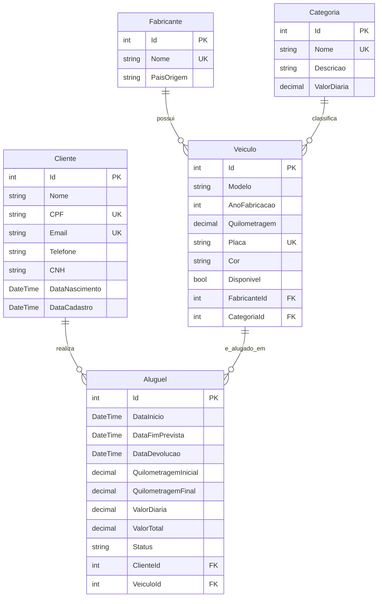

# Documentação Técnica e Especificação das APIs RESTful
## Sistema de Aluguel de Veículos (Locadora de Veículos)

---

### Sumário
1. [Visão Geral e Arquitetura](#1-visão-geral-e-arquitetura)
2. [Modelo de Banco de Dados e Entidades](#2-modelo-de-banco-de-dados-e-entidades)
3. [Padrões de Resposta e Códigos HTTP](#3-padrões-de-resposta-e-códigos-http)
4. [Tratamento Global de Exceções](#4-tratamento-global-de-exceções)
5. [Especificação Detalhada dos Endpoints (CRUDs)](#5-especificação-detalhada-dos-endpoints-cruds)
   - 5.1 [Fabricantes (`/api/fabricantes`)](#51-fabricantes-apifabricantes)
   - 5.2 [Categorias (`/api/categorias`)](#52-categorias-apicategorias)
   - 5.3 [Veículos (`/api/veiculos`)](#53-veículos-apiveiculos)
   - 5.4 [Clientes (`/api/clientes`)](#54-clientes-apiclientes)
   - 5.5 [Aluguéis (`/api/alugueis`)](#55-aluguéis-apialugueis)
6. [Especificação das Rotas de Consultas e Filtros com Joins (`/api/consultas`)](#6-especificação-das-rotas-de-consultas-e-filtros-com-joins-apiconsultas)
7. [Guia de Execução de Testes via Swagger UI](#7-guia-de-execução-de-testes-via-swagger-ui)

---

### 1. Visão Geral e Arquitetura

O sistema foi desenvolvido como uma API RESTful utilizando as seguintes tecnologias:
- **Linguagem:** C# (.NET 9)
- **Framework Web:** ASP.NET Core Web API
- **ORM:** Entity Framework Core 8.0 (Abordagem Code-First)
- **SGBD:** Microsoft SQL Server Express / LocalDB
- **Documentação Interativa:** Swagger / OpenAPI (Swashbuckle 6.5.0)

A arquitetura adota a separação de responsabilidades em camadas:
- **Models:** Entidades que mapeiam as tabelas do banco de dados relacional.
- **Data:** Contexto do Entity Framework (`LocadoraContext`), configurações de integridade via Fluent API e Seed Data.
- **DTOs (Data Transfer Objects):** Objetos de transferência para desacoplamento, validação de entrada (`DataAnnotations`) e formatação de saída.
- **Controllers:** Controladores RESTful expondo os métodos HTTP.
- **Middlewares:** Interceptador global para tratamento centralizado de erros e exceções.

---

### 2. Modelo de Banco de Dados e Entidades

O banco de dados relacional é composto por **5 entidades**:



#### Restrições de Integridade e Índices:
- **Chaves Primárias (PK):** `Id` (Identity/Auto-incremento) em todas as tabelas.
- **Chaves Estrangeiras (FK):**
  - `Veiculos.FabricanteId` -> `Fabricantes.Id` (Restrição: `OnDelete: Restrict`)
  - `Veiculos.CategoriaId` -> `Categorias.Id` (Restrição: `OnDelete: Restrict`)
  - `Alugueis.ClienteId` -> `Clientes.Id` (Restrição: `OnDelete: Restrict`)
  - `Alugueis.VeiculoId` -> `Veiculos.Id` (Restrição: `OnDelete: Restrict`)
- **Índices Únicos (Unique Constraints):**
  - `Fabricantes.Nome`
  - `Categorias.Nome`
  - `Veiculos.Placa`
  - `Clientes.CPF`
  - `Clientes.Email`

---

### 3. Padrões de Resposta e Códigos HTTP

A API adota os seguintes códigos de status HTTP em conformidade com as boas práticas REST:

| Código HTTP | Significado | Situação de Uso |
| :--- | :--- | :--- |
| **200 OK** | Sucesso | Requisição processada com sucesso retornando dados no corpo |
| **201 Created** | Criado | Recurso criado com sucesso (retorna cabeçalho `Location` e o objeto criado) |
| **204 No Content** | Sem Conteúdo | Atualização ou exclusão realizada com sucesso sem retorno de corpo |
| **400 Bad Request** | Requisição Inválida | Falha na validação de entrada, regras de negócio violadas ou FK inexistente |
| **404 Not Found** | Não Encontrado | Recurso solicitado por ID não existe no banco de dados |
| **409 Conflict** | Conflito | Tentativa de cadastro de valor duplicado para campos únicos (CPF, Placa, E-mail) |
| **500 Internal Server Error** | Erro Interno | Exceções inesperadas interceptadas pelo middleware global |

---

### 4. Tratamento Global de Exceções

Implementado através do [`ExceptionMiddleware`](file:///c:/Users/Gabriel/OneDrive/Trabalhos%20ADS/Tecnologias%20para%20An%C3%A1lise%20e%20Desenvolvimento%20de%20Sistemas/trabalho%20part%201/LocadoraVeiculos.API/Middlewares/ExceptionMiddleware.cs). Caso ocorra qualquer erro não tratado durante o processamento de uma requisição, o middleware captura a exceção e retorna a seguinte estrutura JSON com status `500`:

```json
{
  "sucesso": false,
  "mensagem": "Ocorreu um erro interno no servidor ao processar sua solicitação.",
  "detalhe": "Descrição do erro ocorrido",
  "dataHora": "2026-10-04T19:40:00Z"
}
```

---

### 5. Especificação Detalhada dos Endpoints (CRUDs)

#### 5.1 Fabricantes (`/api/fabricantes`)

| Método | Rota | Descrição | Parâmetros | Códigos de Resposta |
| :--- | :--- | :--- | :--- | :--- |
| `GET` | `/api/fabricantes` | Lista todos os fabricantes | Nenhum | `200 OK` |
| `GET` | `/api/fabricantes/{id}` | Busca fabricante por ID | `id` (int, path) | `200 OK`, `404 Not Found` |
| `POST` | `/api/fabricantes` | Cadastra novo fabricante | Body (JSON) | `201 Created`, `400 Bad Request`, `409 Conflict` |
| `PUT` | `/api/fabricantes/{id}` | Atualiza dados do fabricante | `id` (int, path), Body (JSON) | `204 No Content`, `400 Bad Request`, `404 Not Found`, `409 Conflict` |
| `DELETE` | `/api/fabricantes/{id}` | Remove um fabricante | `id` (int, path) | `204 No Content`, `400 Bad Request` (se houver veículos), `404 Not Found` |

**Exemplo de Payload (POST / PUT):**
```json
{
  "nome": "Toyota",
  "paisOrigem": "Japão"
}
```

---

#### 5.2 Categorias (`/api/categorias`)

| Método | Rota | Descrição | Parâmetros | Códigos de Resposta |
| :--- | :--- | :--- | :--- | :--- |
| `GET` | `/api/categorias` | Lista todas as categorias | Nenhum | `200 OK` |
| `GET` | `/api/categorias/{id}` | Busca categoria por ID | `id` (int, path) | `200 OK`, `404 Not Found` |
| `POST` | `/api/categorias` | Cadastra nova categoria | Body (JSON) | `201 Created`, `400 Bad Request`, `409 Conflict` |
| `PUT` | `/api/categorias/{id}` | Atualiza categoria | `id` (int, path), Body (JSON) | `204 No Content`, `400 Bad Request`, `404 Not Found`, `409 Conflict` |
| `DELETE` | `/api/categorias/{id}` | Remove uma categoria | `id` (int, path) | `204 No Content`, `400 Bad Request` (se houver veículos), `404 Not Found` |

**Exemplo de Payload (POST / PUT):**
```json
{
  "nome": "SUV Premium",
  "descricao": "Utilitários esportivos de alto padrão",
  "valorDiaria": 280.00
}
```

---

#### 5.3 Veículos (`/api/veiculos`)

| Método | Rota | Descrição | Parâmetros | Códigos de Resposta |
| :--- | :--- | :--- | :--- | :--- |
| `GET` | `/api/veiculos` | Lista todos os veículos com fabricante e categoria | Nenhum | `200 OK` |
| `GET` | `/api/veiculos/disponiveis` | Lista apenas veículos com `Disponivel == true` | Nenhum | `200 OK` |
| `GET` | `/api/veiculos/{id}` | Busca veículo por ID | `id` (int, path) | `200 OK`, `404 Not Found` |
| `POST` | `/api/veiculos` | Cadastra novo veículo | Body (JSON) | `201 Created`, `400 Bad Request`, `409 Conflict` |
| `PUT` | `/api/veiculos/{id}` | Atualiza veículo | `id` (int, path), Body (JSON) | `204 No Content`, `400 Bad Request`, `404 Not Found`, `409 Conflict` |
| `DELETE` | `/api/veiculos/{id}` | Remove veículo | `id` (int, path) | `204 No Content`, `400 Bad Request` (se houver aluguéis), `404 Not Found` |

**Exemplo de Payload (POST / PUT):**
```json
{
  "modelo": "Corolla Cross",
  "anoFabricacao": 2024,
  "quilometragem": 12500.00,
  "placa": "BRA2E19",
  "cor": "Branco Perolizado",
  "fabricanteId": 1,
  "categoriaId": 3
}
```

---

#### 5.4 Clientes (`/api/clientes`)

| Método | Rota | Descrição | Parâmetros | Códigos de Resposta |
| :--- | :--- | :--- | :--- | :--- |
| `GET` | `/api/clientes` | Lista todos os clientes | Nenhum | `200 OK` |
| `GET` | `/api/clientes/{id}` | Busca cliente por ID | `id` (int, path) | `200 OK`, `404 Not Found` |
| `POST` | `/api/clientes` | Cadastra novo cliente | Body (JSON) | `201 Created`, `400 Bad Request`, `409 Conflict` |
| `PUT` | `/api/clientes/{id}` | Atualiza cliente | `id` (int, path), Body (JSON) | `204 No Content`, `400 Bad Request`, `404 Not Found`, `409 Conflict` |
| `DELETE` | `/api/clientes/{id}` | Remove cliente | `id` (int, path) | `204 No Content`, `400 Bad Request` (se houver aluguéis), `404 Not Found` |

**Exemplo de Payload (POST / PUT):**
```json
{
  "nome": "Carlos Eduardo Pereira",
  "cpf": "123.456.789-10",
  "email": "carlos.pereira@email.com",
  "telefone": "(31) 98765-4321",
  "cnh": "98765432100",
  "dataNascimento": "1992-08-20T00:00:00"
}
```

---

#### 5.5 Aluguéis (`/api/alugueis`)

| Método | Rota | Descrição | Parâmetros | Códigos de Resposta |
| :--- | :--- | :--- | :--- | :--- |
| `GET` | `/api/alugueis` | Lista todos os aluguéis | Nenhum | `200 OK` |
| `GET` | `/api/alugueis/{id}` | Busca aluguel por ID | `id` (int, path) | `200 OK`, `404 Not Found` |
| `GET` | `/api/alugueis/cliente/{clienteId}` | Lista aluguéis de um cliente | `clienteId` (int, path) | `200 OK`, `404 Not Found` |
| `POST` | `/api/alugueis` | Realiza locação (bloqueia veículo) | Body (JSON) | `201 Created`, `400 Bad Request` |
| `PUT` | `/api/alugueis/{id}/devolver` | Registra devolução (calcula total e libera veículo) | `id` (int, path), Body (JSON) | `200 OK`, `400 Bad Request`, `404 Not Found` |
| `DELETE` | `/api/alugueis/{id}` | Cancela locação ativa | `id` (int, path) | `204 No Content`, `400 Bad Request`, `404 Not Found` |

**Payload de Criação de Aluguel (`POST /api/alugueis`):**
```json
{
  "clienteId": 1,
  "veiculoId": 1,
  "dataInicio": "2026-10-01T08:00:00",
  "dataFimPrevista": "2026-10-06T08:00:00"
}
```

**Payload de Devolução (`PUT /api/alugueis/{id}/devolver`):**
```json
{
  "dataDevolucao": "2026-10-06T09:30:00",
  "quilometragemFinal": 13150.00
}
```

---

### 6. Especificação das Rotas de Consultas e Filtros com Joins (`/api/consultas`)

Implementadas em [`ConsultasController.cs`](file:///c:/Users/Gabriel/OneDrive/Trabalhos%20ADS/Tecnologias%20para%20An%C3%A1lise%20e%20Desenvolvimento%20de%20Sistemas/trabalho%20part%201/LocadoraVeiculos.API/Controllers/ConsultasController.cs), contemplando 5 filtros com **INNER JOIN** e **LEFT OUTER JOIN**:

#### 📌 Filtro 1: Aluguéis Detalhados
- **Rota:** `GET /api/consultas/alugueis-detalhados`
- **Tipo de Join:** **INNER JOIN** entre 5 tabelas (`Alugueis`, `Clientes`, `Veiculos`, `Fabricantes`, `Categorias`).
- **Parâmetros Opcionais (Query):**
  - `clienteNome` (string)
  - `modelo` (string)
  - `fabricanteNome` (string)
  - `status` (string: "Ativo", "Concluido", "Cancelado")
  - `dataInicio` (DateTime)
  - `dataFim` (DateTime)
- **Resposta:** Lista com todos os dados consolidados do aluguel, veículo, marca, categoria e cliente.

---

#### 📌 Filtro 2: Faturamento Consolidado por Categoria
- **Rota:** `GET /api/consultas/faturamento-por-categoria`
- **Tipo de Join:** **INNER JOIN** com agregação (`Categorias` ⨝ `Veiculos` ⨝ `Alugueis`).
- **Parâmetros Opcionais (Query):**
  - `dataInicio` (DateTime)
  - `dataFim` (DateTime)
- **Resposta:** Total de locações, faturamento total gerado e ticket médio por categoria de veículo.

---

#### 📌 Filtro 3: Resumo de Clientes e Histórico de Locações
- **Rota:** `GET /api/consultas/clientes-resumo-locacoes`
- **Tipo de Join:** **LEFT OUTER JOIN** (`Clientes` ⟕ `Alugueis` via `GroupJoin` e `DefaultIfEmpty`).
- **Parâmetros Opcionais (Query):**
  - `apenasSemAluguel` (boolean: `true` para listar apenas clientes que nunca alugaram, `false` para ativos)
  - `termoBusca` (string: busca por Nome, CPF ou E-mail)
- **Resposta:** Resumo com total de aluguéis, total gasto, data do último aluguel e status de atividade.

---

#### 📌 Filtro 4: Utilização e Métricas de Veículos
- **Rota:** `GET /api/consultas/veiculos-utilizacao`
- **Tipo de Join:** **LEFT OUTER JOIN** + **INNER JOIN** (`Veiculos` ⨝ `Fabricantes` ⨝ `Categorias` ⟕ `Alugueis`).
- **Parâmetros Opcionais (Query):**
  - `categoriaId` (int)
  - `fabricanteId` (int)
  - `apenasNuncaAlugados` (boolean)
  - `disponivel` (boolean)
- **Resposta:** Dados do veículo, total de locações realizadas, quilometragem total rodada em locações e receita gerada pelo veículo.

---

#### 📌 Filtro 5: Desempenho e Volume de Negócios por Fabricante
- **Rota:** `GET /api/consultas/fabricantes-desempenho`
- **Tipo de Join:** **LEFT OUTER JOIN** Múltiplo (`Fabricantes` ⟕ `Veiculos` ⟕ `Alugueis`).
- **Parâmetros Opcionais (Query):**
  - `paisOrigem` (string)
  - `nome` (string)
- **Resposta:** Total de veículos cadastrados, total de locações e receita acumulada gerada por fabricante/marca.

---

### 7. Guia de Execução de Testes via Swagger UI

Para cumprir a evidência prática com capturas de tela (Item 3.3):

1. Inicie a aplicação via terminal:
   ```bash
   dotnet run --project LocadoraVeiculos.API
   ```
2. Abra o navegador em: **`http://localhost:5205`**
3. Siga o fluxo de testes sugerido e capture o print da tela do Swagger (contendo o botão *Execute*, a *Request URL* e o *Server Response* com código `200`/`201`):
   - **Teste 1:** `GET /api/fabricantes` (Evidência do Seed Data de Marcas).
   - **Teste 2:** `GET /api/categorias` (Evidência do Seed Data de Categorias).
   - **Teste 3:** `POST /api/clientes` (Cadastrar um novo cliente).
   - **Teste 4:** `POST /api/veiculos` (Cadastrar um veículo vinculado ao fabricante e categoria).
   - **Teste 5:** `POST /api/alugueis` (Efetuar a locação do veículo).
   - **Teste 6:** `GET /api/veiculos/disponiveis` (Comprovar que o veículo alugado não aparece na lista de disponíveis).
   - **Teste 7:** `PUT /api/alugueis/{id}/devolver` (Registrar a devolução e comprovar o cálculo automático do valor total).
   - **Teste 8:** `GET /api/consultas/alugueis-detalhados` (Comprovar o funcionamento do INNER JOIN com filtros).
   - **Teste 9:** `GET /api/consultas/clientes-resumo-locacoes` (Comprovar o funcionamento do LEFT JOIN).
   - **Teste 10:** `GET /api/consultas/faturamento-por-categoria` (Comprovar o relatório de faturamento consolidado).
